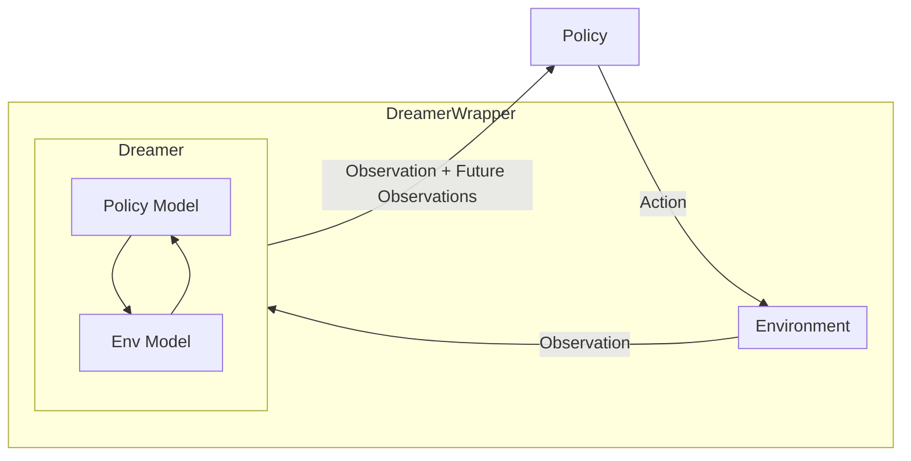

# I2A for Continuous Control

## 📖  Overview

This project contains a Gymnasium wrapper with implementation of dreamer introduced in PIP-Loco[1]. The dreamer which can predict future observations is trained along side a policy trained using Deep Reinforcment Learning (DRL). The dreamer is implemented as a Gymnasium wrapper, with a buffer of its own, and appends the current observation with the predicted future observations. Thus it is agnostic to the RL algorithm used. This implementation is specifically made for compatibility with Gymnasium MuJoCo continuous control tasks. 




## 📁 Folder Structure

```config``` contains PPO hyperparameters for gymnasium environments.

```env``` Contains the implementation for DreamerWrapper.

```eval``` Scripts for evluating triained policies against Gaussian noise.

```logs(local)``` Tensorboard logs

```train``` Training scripts

```viz``` Scripts for plotting training and evaluation performance


## 🛠️ Usage
1. Go to train directory
```bash
cd train
```

2. Run ```train_script``` with path to config and provide a name for the experiment. Refer ```config``` for sample config files
```bash
python train_script.py [--config CONFIG_PATH] [--name EXPERIMENT_NAME]

```
Example 
```bash
python train_script.py --config configs/ppo_config.yaml --name humanoid_exp1
```

3. ```train/train_dispatcher``` automates running multiple PPO experiments using different configuration combinations (seeds, wrappers, future steps). It modifies YAML config files on the fly and invokes `train.py`.


## 🔗 References
[1] A. Shirwatkar _et al._, “PIP-Loco: A proprioceptive infinite horizon planning framework for quadrupedal robot locomotion,” _arXiv preprint arXiv:2409.09441_, 2024.

[2] S. Racanière _et al._, “Imagination-augmented agents for deep reinforcement learning,” in _Advances in Neural Information Processing Systems (NeurIPS)_, vol. 30, 2017.